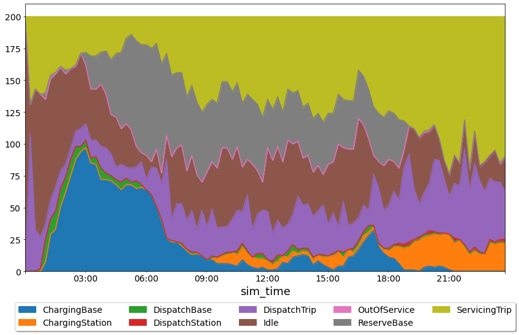
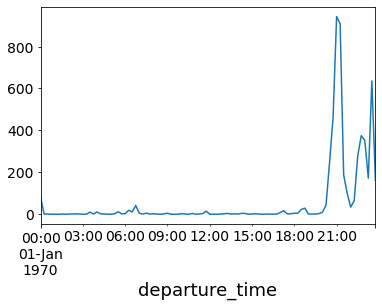
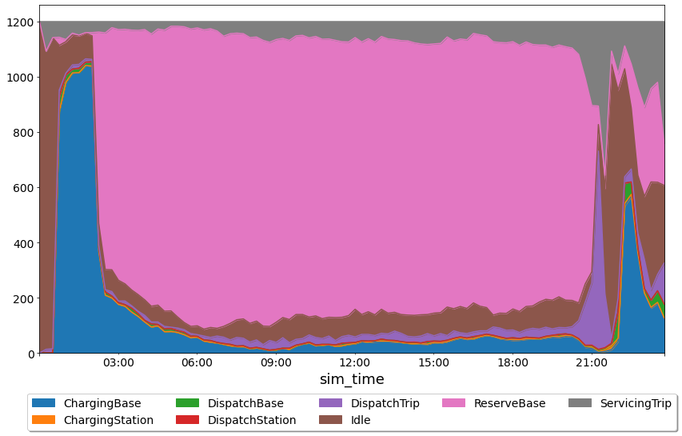
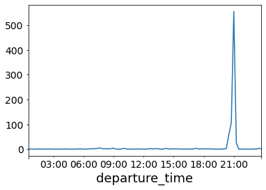

# Example

In this document we'll run through a full example of running the hive model over a set of inputs and interpreting the results.
We'll use the pre-packaged manhattan scenario for this example which can be found at the path `nrel.hive.resources.scenarios.manhattan`

## Scenario Inputs

Before we begin, take a look [the scenario input files](https://github.com/NREL/hive/tree/main/nrel/hive/resources/scenarios/manhattan) for this scenario.

This scenario uses open taxi data from New York City.
The full dataset has been downsampled to produce 20,000 requests over a single 24 hour period.  

Looking at the requests data we see:

```python
import pandas as pd

demand_df = pd.read_csv("<path-to-hive-repo>/nrel/hive/resources/scenarios/manhattan/requests/nyc_20k.csv")

demand_df["departure_time"] = pd.to_datetime(demand_df.departure_time, unit="s")

demand_df.groupby("departure_time").request_id.count().resample("15T").sum().plot()
```


This shows the number of requests over 15 minute time periods.
The demand remains steady during the morning through to the afternoon and then spikes in the evening.

## Running

Running this scenario is built into hive and so you can do

```bash
hive manhattan.yaml
```

This should take a few minutes to run and when you're done you should see something like:

```console
                        Summary Stats
┏━━━━━━━━━━━━━━━━━━━━━━━━━━━━━━━━━━━━━━━━━━━━━━┳━━━━━━━━━━━━━┓
┃ Stat                                         ┃ Value       ┃
┡━━━━━━━━━━━━━━━━━━━━━━━━━━━━━━━━━━━━━━━━━━━━━━╇━━━━━━━━━━━━━┩
│ Mean Final SOC                               │ 47.13       │
│ Requests Served                              │ 73.13       │
│ Time in State Idle                           │ 20.08       │
│ Time in State DispatchTrip                   │ 15.65       │
│ Time in State ServicingTrip                  │ 32.28       │
│ Time in State DispatchBase                   │ 1.24        │
│ Time in State ReserveBase                    │ 16.14       │
│ Time in State ChargingBase                   │ 10.6        │
│ Time in State DispatchStation                │ 0.26        │
│ Time in State ChargingStation                │ 3.63        │
│ Time in State OutOfService                   │ 0.13        │
│ Total Kilometers Traveled                    │ 95580.91 km │
│ Kilometers Traveled in State DispatchTrip    │ 26733.61 km │
│ Kilometers Traveled in State ServicingTrip   │ 65938.94 km │
│ Kilometers Traveled in State DispatchBase    │ 2427.35 km  │
│ Kilometers Traveled in State DispatchStation │ 481.02 km   │
│ Station Revenue                              │ $ 858.19    │
│ Fleet Revenue                                │ $ 103926.63 │
└──────────────────────────────────────────────┴─────────────┘
```

## Review Outputs

To analyze the outputs we can use the pandas package.
We can load the state log like this:

```python
import pandas as pd

state_df = pd.read_json("<scenario-outputs>/state.log", lines=True)
```

Then, we can extract the vehicle states for visualization

```python
vehicle_df = state_df[state_df.report_type == 'VEHICLE_STATE']

# drop Null columns from other report types
vehicle_df = vehicle_df.dropna(axis=1, how="all")
```

Next, let's look at the distribution of vehicle states over the simulation:

```python
plot_df = (
    vehicle_df.groupby(["sim_time", "vehicle_state"])
    .vehicle_id.count()
    .reset_index()
    .pivot(index="sim_time", columns="vehicle_state", values="vehicle_id")
)

# downsample to every 15 minutes to reduce noise
plot_df = plot_df.iloc[::15]

plot_df.plot.area(ax=ax)
```



There's a lot of information here but we can see that at the start of the simualtion most of the vehicles are idling and then moving to nearest base, charging when they get there.

We can also see that during the time of peak demand (around 8pm), the vehicle reserves are depleted and nearly all the vehicles are either charging, dispatching or servicing a trip. 

Note that the summary stats indicated that we only served about 73% of the demand and this is likely caused by the fleet being too small to handle the large spike in demand at the end of the day.

Let's take a look at the number of cancelled requests to confirm our theory.

To do that, we'll have to load the event log and count up the number of cancelled request events.

```python
event_df = pd.read_json("<scenario-outputs>/event.log", lines=True)
event_df["departure_time"] = pd.to_datetime(event_df.departure_time)

canceled = event_df[event_df.report_type == "cancel_request_event"]

canceled.groupby("departure_time").request_id.count().resample("15T").sum().plot()
```



Indeed, we see a huge spike of cancelled requests during the demand peak.

## Changing Parameters and Rerunning

Let's update how many vehicles we have in the simulation from 200 to 1200 to see how that impacts the simulation.

We already have a file `nyc_1200.csv` in the manhattan scenario directory (in the `vehicles` sub folder) and so we can modify our simulation yaml such that the `vehicles_file` points to the new file:

```yaml
input:
  vehicles_file: nyc_1200.csv
```

Now, we can re-run:

```bash
hive manhattan.yaml
```

And we get a new set of summary stats like:

```console
                         Summary Stats
┏━━━━━━━━━━━━━━━━━━━━━━━━━━━━━━━━━━━━━━━━━━━━━━┳━━━━━━━━━━━━━━┓
┃ Stat                                         ┃ Value        ┃
┡━━━━━━━━━━━━━━━━━━━━━━━━━━━━━━━━━━━━━━━━━━━━━━╇━━━━━━━━━━━━━━┩
│ Mean Final SOC                               │ 85.89%       │
│ Requests Served                              │ 95.93%       │
│ Time in State Idle                           │ 11.19%       │
│ Time in State DispatchTrip                   │ 3.09%        │
│ Time in State ServicingTrip                  │ 7.17%        │
│ Time in State DispatchBase                   │ 1.15%        │
│ Time in State ReserveBase                    │ 66.39%       │
│ Time in State ChargingBase                   │ 10.88%       │
│ Time in State DispatchStation                │ 0.01%        │
│ Time in State ChargingStation                │ 0.13%        │
│ Total Kilometers Traveled                    │ 132136.83 km │
│ Kilometers Traveled in State DispatchTrip    │ 30534.36 km  │
│ Kilometers Traveled in State ServicingTrip   │ 88306.54 km  │
│ Kilometers Traveled in State DispatchBase    │ 13183.86 km  │
│ Kilometers Traveled in State DispatchStation │ 112.07 km    │
│ Station Revenue                              │ $ 1270.05    │
│ Fleet Revenue                                │ $ 139046.74  │
└──────────────────────────────────────────────┴──────────────┘
```

It looks like our demand served jumped up to 96%!

If we re-run the anaylsis code above we get the following:



Now, we can start to see the trade-offs of increasing the fleet size.
Even though we did a much better job of meeting demand, a huge percentage of the fleet sits in the reserves during the majority of the day.

If we look at the number of canceled requests we see:



We still see a large spike in cancelled requests during the peak.
This is likely due to the fact that the dipatcher is not doing any smart repositioning.
By the time the demand hits, vehicles are just sitting in the bases and don't have enough time to get to the requests before the 10 minute timeout hits.


TODO: add a section on station and grid loads
