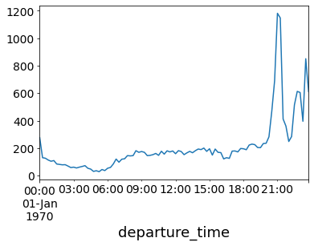

# Example

In this document we'll run through a full example of running the hive model over a set of inputs and interpreting the results.
We'll use the pre-packaged manhattan scenario for this example which can be found at the path `nrel.hive.resources.scenarios.manhattan`

## Scenario Inputs

Before we begin, take a look [the scenario input files](https://github.com/NREL/hive/tree/main/nrel/hive/resources/scenarios/manhattan) for this scenario.

This scenario uses open taxi data from New York City.
The full dataset has been downsampled to produce 20,000 requests over a single 24 hour period.  

Looking at the requests data we see:

```python
import pandas as pd

demand_df = pd.read_csv("<path-to-hive-repo>/nrel/hive/resources/scenarios/manhattan/requests/nyc_20k.csv")

demand_df["departure_time"] = pd.to_datetime(demand_df.departure_time, unit="s")

demand_df.groupby("departure_time").request_id.count().resample("15T").sum().plot()
```



This shows the number of requests over 15 minute time periods.
The demand remains steady during the morning through to the afternoon and then spikes in the evening.

## Running

Running this scenario is built into hive and so you can do

```bash
hive manhattan.yaml
```

This should take a few minutes to run and when you're done you should see something like:

```console
                        Summary Stats
┏━━━━━━━━━━━━━━━━━━━━━━━━━━━━━━━━━━━━━━━━━━━━━━┳━━━━━━━━━━━━━┓
┃ Stat                                         ┃ Value       ┃
┡━━━━━━━━━━━━━━━━━━━━━━━━━━━━━━━━━━━━━━━━━━━━━━╇━━━━━━━━━━━━━┩
│ Mean Final SOC                               │ 47.13       │
│ Requests Served                              │ 73.13       │
│ Time in State Idle                           │ 20.08       │
│ Time in State DispatchTrip                   │ 15.65       │
│ Time in State ServicingTrip                  │ 32.28       │
│ Time in State DispatchBase                   │ 1.24        │
│ Time in State ReserveBase                    │ 16.14       │
│ Time in State ChargingBase                   │ 10.6        │
│ Time in State DispatchStation                │ 0.26        │
│ Time in State ChargingStation                │ 3.63        │
│ Time in State OutOfService                   │ 0.13        │
│ Total Kilometers Traveled                    │ 95580.91 km │
│ Kilometers Traveled in State DispatchTrip    │ 26733.61 km │
│ Kilometers Traveled in State ServicingTrip   │ 65938.94 km │
│ Kilometers Traveled in State DispatchBase    │ 2427.35 km  │
│ Kilometers Traveled in State DispatchStation │ 481.02 km   │
│ Station Revenue                              │ $ 858.19    │
│ Fleet Revenue                                │ $ 103926.63 │
└──────────────────────────────────────────────┴─────────────┘
```

## Review Outputs

To analyze the outputs we can use the pandas package.
We can load the state log like this:

```python
import pandas as pd

state_df = pd.read_json("manhattan_20k_2022-10-27_13-45-09//state.log", lines=True)
```


